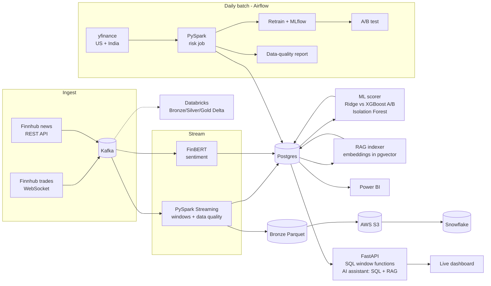

# Real-Time Stock Market Intelligence Platform

A complete data platform for live stock data: streaming ingestion, stream processing,
machine learning, A/B testing, NLP, GenAI, a daily batch layer, data quality, and CI/CD.

**Stack:** Kafka · PySpark (Structured Streaming + batch) · PostgreSQL · Airflow · MLflow ·
XGBoost · scikit-learn · FinBERT · RAG (pgvector + embeddings) · LLM agent · FastAPI · Docker · GitHub Actions ·
Databricks (Delta Lake) · AWS S3 · Snowflake · Power BI



## What's inside

| Folder | What it does | Main skills |
|---|---|---|
| `producer/` | Streams live trades into Kafka (or simulates them) | Kafka, WebSocket APIs |
| `streaming/` | Candles, volatility and bad-record quarantine in real time | PySpark Structured Streaming, windows, watermarks |
| `ml/` | Volatility forecasting, anomaly detection, online A/B test | XGBoost, scikit-learn, MLflow, hypothesis testing |
| `nlp/` | News headlines → financial sentiment | Transformers (FinBERT), Kafka consumer |
| `batch/` | Daily US + Indian prices → risk metrics → data-quality checks | PySpark batch, Window functions, VaR/Sharpe/beta |
| `airflow/` | Schedules the daily batch jobs | Airflow DAGs |
| `genai/` | AI assistant: an agent that routes questions to live SQL data and/or RAG over docs, news and reports, with citations and a retrieval eval | RAG, embeddings, pgvector, LLM agents, text-to-SQL, guardrails |
| `api/` | REST API and live dashboard | FastAPI, SQL window functions |
| `databricks/` | Same pipeline on Databricks | Delta Lake, medallion architecture |
| `cloud/` | Optional data-lake export | AWS S3, Snowflake |
| `tests/`, `.github/` | Unit tests, CI, CD | Pytest, GitHub Actions, GHCR |

New to this? Read **[docs/WHY.md](docs/WHY.md)** first: every part explained simply,
with why it exists and how to answer interview questions about it.

## Run it

**Easiest: GitHub Codespaces.** Click *Code → Codespaces → Create codespace*, wait for setup, then:

```bash
make up          # starts Kafka, Postgres, producer, Spark, scorer, API
```

Open the **Dashboard** port (8000). Candles appear after ~1 minute.

**Locally:** install Docker Desktop, then `cp .env.example .env` and `make up`.

Then, step by step:

| When | Command | What happens |
|---|---|---|
| after ~45 min | `make train` | trains the models (the scorer picks them up automatically: `docker compose restart scorer`) |
| after ~2 hours | `make abtest` | formal A/B test: is XGBoost significantly better than Ridge? |
| any time | `make daily` | daily batch: US + Indian prices → PySpark risk job → data-quality report |
| optional | `docker compose --profile nlp up -d --build` | news sentiment (downloads FinBERT, ~2 GB) |
| optional | `docker compose --profile airflow up -d --build` | Airflow UI on port 8081 |
| after `make daily` | `make rageval` | measures RAG retrieval quality (hit rate@3, MRR) |
| any time | `make test` · `make mlflow` | run tests · open experiment tracking on port 5000 |

Useful pages: dashboard `:8000` · API docs `:8000/docs` · Kafka UI `:8080` · Spark UI `:4040`.

For deployment (GitHub, Codespaces, Databricks, Power BI) see **[docs/DEPLOY.md](docs/DEPLOY.md)**.

## Results

_Fill in after your own run (see docs/RESUME_BULLETS.md):_

| Metric | Value |
|---|---|
| Throughput | ___ trades/sec |
| End-to-end latency (trade → dashboard) | ___ seconds |
| Forecast MAE: baseline / Ridge / XGBoost | ___ / ___ / ___ |
| A/B test result | ___ (p = ___) |
| Data-quality checks passing | ___ / 6 |
| RAG retrieval hit rate@3 / MRR | ___ / ___ |


